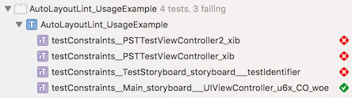

# AutoLayoutLint

[](https://circleci.com/gh/ypresto/AutoLayoutLint)
[](http://cocoapods.org/pods/AutoLayoutLint)
[](http://cocoapods.org/pods/AutoLayoutLint)
[](http://cocoapods.org/pods/AutoLayoutLint)

AutoLayoutLint provides automated test to detect runtime conflicts of Auto Layout
constraints in each view controller.



## Why

Auto Layout is simple and powerful solution to create responsible views.
But there are pitfalls of conflicting constraints on specific screen sizes,
and they cannot be detected statically. This library helps detecting runtime
conflicts using unit test.

## How it works

Iterates through all view controllers in app and manually sets
`view.frame.size` to specified screen sizes to detect conflicting constraints.

It utilizes method/function swizzling for testing:

- Swizzles caller objc method of well-known `UIViewAlertForUnsatisfiableConstraints` function for detection.
- Stubs `viewDidLoad` to keep from I/O or assertion failure in your code.

## Usage

1. Create subclass of `PSTAutoLayoutLintTestCase` in your test directory.
2. Implement `+ (NSArray<NSValue *> *)screenSizes` to provide sizes to be tested.
   You can use `+[PSTAutoLayoutLintTestCase valueWithWidth:height:]` for convenience.

```objc
@import AutoLayoutLint;

@interface YourAutoLayoutLintTests : PSTAutoLayoutLintTestCase

@end

@implementation YourAutoLayoutLintTests

+ (NSArray<NSValue *> *)screenSizes
{
    return @[
        [self valueWithWidth:320 height:480], // iPhone 4S
        [self valueWithWidth:480 height:320],
        [self valueWithWidth:320 height:568], // iPhone 5, 5S
        [self valueWithWidth:568 height:320],
        [self valueWithWidth:375 height:667], // iPhone 6, 6S
        [self valueWithWidth:667 height:375],
        [self valueWithWidth:414 height:736], // iPhone 6 Plus, 6S Plus
        [self valueWithWidth:736 height:414],
    ];
}

- (void)testDummy
{
    // NOTE: Workaround for Xcode bug.
    // Refer: https://github.com/ypresto/AutoLayoutLint/issues/1
}

@end
```

Refer `Example/AutoLayoutLint_UsageExample/AutoLayoutLint_UsageExample.m` for
example of PSTAutoLayoutLintTestCase subclass.

Refer [The Ultimate Guide To iPhone Resolutions](http://www.paintcodeapp.com/news/ultimate-guide-to-iphone-resolutions) for screen sizes of each device.

### Excluding specific view controller or screen size

Implement `+ (BOOL)shouldTestViewControllerWithLabel:(NSString * _Nonnull)label screenSize:(CGSize)screenSize`
   if you want to skip some of tests.


## Running usage example

UsageExample target is disabled by default as it fails (intended).
Please enable from `Edit Scheme -> Test -> Info" before execute Test task to run it.

## Requirements

- iOS 8.0+
- Tested on Xcode 7.1

## Installation

### Carthage

```
github "ypresto/AutoLayoutLint" ~> 0.1.0
```

### Cocoapods

```
target 'Your_Tests_Target', exclusive: true do
  pod 'AutoLayoutLint', '~> 0.1.0'
end
```

## Author

Yuya Tanaka (Github: @ypresto / Twitter: [yuya_presto](https://twitter.com/yuya_presto))

## License

AutoLayoutLint is available under the MIT license. See the LICENSE file for more info.
